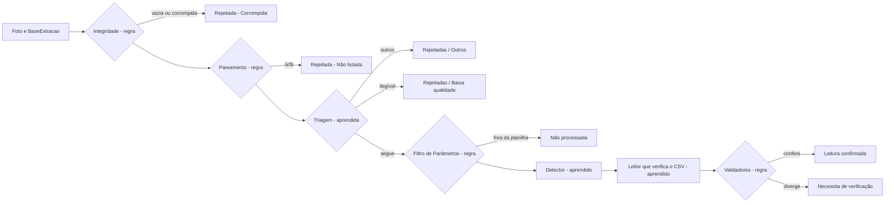

# Ficha de arquitetura — Lab02

Projeto de leitura automatizada de fotografias de medidores de uma
concessionária de energia do Nordeste. Arquitetura B aperfeiçoada (README,
seção 1). Os números completos estão no `lab2_README.md` (README) e no
`lab02.ipynb`; esta ficha registra as decisões e aponta para a evidência.

## 1. Decisão apoiada

| Pergunta | Resposta |
| --- | --- |
| Decisão | Para cada foto: leitura confirmada, necessita de verificação, rejeitada (corrompida, não listada, outros, baixa qualidade) ou não processada |
| Unidade de análise | A foto. Cada foto é uma leitura nesta base (README 4.2) |
| Quem age | O analista confere as fotos em "Verificar" e decide as rejeitadas, se quiser |
| Erro mais caro | Aprovar uma leitura errada: devolução em dobro do valor cobrado a mais. Em seguida, perder em silêncio uma foto de medidor legível |
| Onde roda | Lote pós-coleta, Windows local, CPU de 4 núcleos e 8 GB, sem GPU (piso); GPU NVIDIA opcional |

## 2. Sub-tarefas

| Sub-tarefa | Aprendida ou regra | Tipo | Saída | Ativação | Perda | Rótulo |
| --- | --- | --- | --- | --- | --- | --- |
| Foto íntegra? | Regra | — | Sim/não | — | — | — (limiar calibrado à mão) |
| Foto listada no BaseExtracao? | Regra | — | Sim/não | — | — | — |
| Cena: digital, ciclométrico, outros | Aprendida | Classificação exclusiva | 3 logits | Softmax | Entropia cruzada ponderada, rótulo parcial no indeterminado | 1 classe por foto (C2) |
| Medidor ilegível? | Aprendida | Binária, independente do tipo | 1 logit | Sigmoide | BCE com `pos_weight`, mascarada | Legível/ilegível (C2) |
| Onde está o display e a placa? | Aprendida (ET5) | Detecção | Caixas + classe | Por caixa | Caixa + classe (SSDlite) | Caixas desenhadas |
| Qual sequência está no recorte? | Aprendida (ET6) | Sequência | Dígitos | Softmax por passo | CTC | Transcrição do recorte |
| A leitura confere com o CSV? | **Regra** | Comparação | Sim/não | — | — | — |
| Função 03, criticidade, Parâmetros | **Regra** | Validação | Sim/não | — | — | — |

## 3. Pipeline

Versão resumida. O diagrama completo, com os módulos numerados, está no
anexo [Arquitetura B aperfeiçoada](anexos/lab2_arquitetura_B_multiclasse.jpg);
o da arquitetura de comparação, em
[Arquitetura A melhorada](anexos/lab2_arquitetura_A_divisao_de_classes.jpg).
O roteador de triagem (módulo B5) foi implementado como um escore único com
um limiar (seção 9).

Taxa por estágio, para uma foto de medidor legível listada chegar a
"Leitura confirmada" (README 3.3):

| Estágio | Taxa | Origem |
| --- | --- | --- |
| Integridade | 1,00 (limite inferior 0,91) | Medida: 0 de 34 fotos com conteúdo descartadas |
| Pareamento | 1,00 | Por definição (nome exato) |
| Triagem | 1,00 (limite inferior 0,98) | Medida: 0 de 146 legíveis rejeitados, fora do lote |
| Detector | 0,95 | Hipótese de trabalho, a medir na ET5 |
| Leitor | 0,90 | Hipótese de trabalho, a medir na ET6 |

Produto: 0,855 com as taxas pontuais; cerca de 0,76 com os limites
inferiores. Só a integridade e a triagem perdem fotos em silêncio, e as duas
foram medidas perto de zero; os erros do detector e do leitor viram
divergência e custam tempo de analista, não fatura.

## 4. Contrato de entrada

| Modelo | Tamanho | Proporção | Pré-processamento | Normalização | Canais |
| --- | --- | --- | --- | --- | --- |
| Triagem | 224 px no lado menor (299 × 224 ou 224 × 299) | Mantida | Autocontraste fixo (`cutoff=1`) na foto original, antes de redimensionar: é a imagem que o rotulador viu (esquema, versão 4) | ImageNet | RGB |
| Detector (ET5) | 320 × 320 | A definir | A definir | ImageNet | RGB |
| Leitor (ET6) | Recorte na resolução nativa | Mantida | A definir | A definir | Tons de cinza (provável) |

224 px em vez da nativa (480 × 360): empate no D3 (−0,012; IC de −0,090 a
+0,066) com cerca de 2,6 vezes menos operações. A cena é uma decisão sobre a
imagem inteira; a leitura nunca usa a foto reduzida.

## 5. Espinha dorsal

**MobileNetV3-Large** (pesos ImageNet do `torchvision`, congelada).

| Alternativa | Por que foi descartada |
| --- | --- |
| EfficientNet-B0 | Empatou no D3 (+0,027 a favor da Large; IC de −0,079 a +0,128), com cerca de 1,8 vez as operações da Large e 4,0 M contra 3,0 M de parâmetros; o desempate do protocolo, fixado antes do treino, é o menor custo em CPU |
| MobileNetV3-Small | Características mais fracas (67,7% contra 75,3% no ImageNet) por uma economia pequena, numa triagem que já roda em 3,3 ms |
| ResNet-18 | 11,7 M de parâmetros e menos precisa que a Large no ImageNet |

A Large também é a espinha do detector do perfil CPU (SSDlite), o que
mantém uma única família de modelos no produto.

## 6. Cabeças

Tabela completa e exemplo real no README 4.3.

| Cabeça | Saídas | Ativação | Perda | Exclusivas? |
| --- | --- | --- | --- | --- |
| Cena | 3 | Softmax | Entropia cruzada ponderada; indeterminado com −log(p_d + p_c) | Sim: um tipo por foto, pelo esquema |
| Legibilidade | 1 | Sigmoide | BCE com `pos_weight`, mascarada em "outros" | Independente do tipo |

| Alternativa | Por que foi descartada |
| --- | --- |
| Cena plana com 4 classes (indeterminado como classe) | O indeterminado é falta de informação, não um tipo; o modelo aprenderia a prever "não sei" em vez do tipo |
| Três cabeças hierárquicas ("medidor?" e depois "qual tipo?") | Uma cabeça a mais, com o tipo treinado só em medidores (poucos ciclométricos); empate técnico com a escolhida |
| Legibilidade como classe da softmax de cena | Tipo e legibilidade coexistem na mesma foto |

## 7. Desbalanceamento

Distribuição fora do teste (261 fotos): 18 de "outros" (6,9%), 77 medidores
ilegíveis e 166 legíveis (31,7% de ilegíveis entre os medidores, contando os
zeros; 29,8% só na amostra aleatória).

Técnica: peso por classe N/(3·n_c) na cena e `pos_weight` =
negativos/positivos na legibilidade, recalculados no treino de cada dobra.
Consequência medida: as probabilidades ficaram infladas nas classes raras;
foi corrigido na calibração, subtraindo o log dos pesos (seção 9).

| Alternativa | Por que foi descartada |
| --- | --- |
| Reamostragem | O treino é em lote completo (cerca de 170 fotos): toda foto entra em todo passo |
| *Focal loss* | Mais um hiperparâmetro, sem busca permitida pelo protocolo; o problema não é excesso de exemplos fáceis, e sim poucos exemplos raros |

## 8. Capacidade × rótulos

300 fotos rotuladas: 225 aleatórias fora do teste, das quais cerca de 170
por dobra de treino, e só 17 de "outros". Estratégia: extração de
características, com 3.844 parâmetros treináveis de 2.975.796 (774 vezes
menos que o ajuste fino).

O ajuste fino parcial nunca foi testado: com 17 exemplos da classe rara, o
guia (seção 8) e o sobreajuste já visto em extração (perda de treino de 0,02
contra 0,90 fora da dobra) desaconselham. A curva de suficiência sobe sem
platô (README 4.6): mais rótulos devem ajudar antes de mais capacidade.

## 9. Confiança e recusa

- **Calibração:** correção dos pesos de classe e temperatura por cabeça
  (2,231 e 1,961), ajustadas fora do lote; ECE de P(rejeitável) de 0,091
  (README 4.7). A temperatura sozinha piorou o ECE: foi o diagnóstico que
  levou à correção.
- **Regra de decisão:** rejeita se P(rejeitável) = P(outros) +
  P(medidor) × P(ilegível | medidor) ≥ 0,966; destino "Outros" se a parcela
  de "outros" for a maior, senão "Baixa qualidade". Todo o resto segue
  adiante, que é o caminho seguro.
- **Meta da triagem (E2):** cobertura da rejeição ≥ 38,0% com risco ≤ 10% e
  perda ≤ 3%, pelo limite superior de 95%. Cabe na curva sem folga (README
  4.8).
- **Meta do sistema (V2):** precisão ≥ 99,3% em "Leitura confirmada",
  abaixo do erro das anotações de campo (0,7%); sem meta de cobertura
  (README 3.7).
- Limiares e temperaturas escolhidos só na validação; o teste segue lacrado.

## 10. Aumento de dados

Nenhum aumento foi usado na triagem: as características são extraídas uma
vez e guardadas em cache, e as cabeças são lineares. Aumentar os dados
exigiria extrair de novo a cada época, multiplicando o custo, sem evidência
de ganho com cabeças lineares.

Para os próximos modelos:

| Transformação | Modelo | Muda o rótulo? |
| --- | --- | --- |
| Espelhamento horizontal | Leitor | Sim: um dígito espelhado não é dígito. Proibido |
| Rotação pequena (±10°) | Detector, leitor | Não |
| Brilho e contraste moderados | Todos | Não, dentro do que o autocontraste já normaliza |
| Desfoque e reflexo sintéticos | Triagem (legibilidade) | Sim: pode tornar a foto ilegível. Proibido sem novo rótulo |
| Recorte aleatório | Detector | Sim, se cortar o display. Só com as caixas ajustadas |

## 11. Partição

Por lote, cronológica: treino 20/05 e 21/05, validação 22/05, teste 03/07.
Zero fotos e zero medidores com foto em comum entre os conjuntos (README
4.2). Na avaliação, validação por lote deixado de fora nos três lotes fora
do teste (protocolo, seção 2.2).

## 12. Sanidade

Formas (B1), perda inicial próxima da referência (D1: 1,213 contra 1,012 na
cena; 0,707 contra 0,693 na legibilidade), sobreajuste de 16 fotos reais até
0,014 com 16/16 e 13/13 de acerto (D2), e o profundo vencendo a baseline por
+0,256 (D3). Detalhes no README 4.4 e 4.5.

## 13. Implantação

| Item | Valor |
| --- | --- |
| Volume adotado | Cerca de 3.100 fotos por extração (os lotes recebidos); volume real a confirmar com o cliente |
| Latência da triagem em CPU, 4 threads (p50 / p95) | ONNX Runtime: 7,9 / 9,6 ms com pré-processamento; PyTorch: 17,0 / 21,7 ms |
| Tempo da triagem por lote | Menos de 1 minuto |
| Exportação | ONNX (opset 18), entrada de tamanho variável; paridade 1,05 × 10⁻⁵ |
| Motor do produto | PyTorch ou ONNX Runtime, decidido na ET9 com os três modelos medidos |
| Onde roda | Windows local, instalador com Python embutido; Docker como caminho secundário |

Licenças: PyTorch e `torchvision` (BSD-3), ONNX Runtime (MIT), detector
SSDlite (BSD-3); YOLO (AGPL-3.0) descartado. **A verificar:** os termos de
uso comercial dos pesos pré-treinados no ImageNet, antes da ET9.

## 14. O que decidimos não fazer

| Não fizemos | Por quê |
| --- | --- |
| Ajuste fino da espinha | 17 exemplos de "outros" e sobreajuste já em extração (seção 8) |
| Modelo ponta a ponta | Não existe rótulo final; dígitos de 7 px na foto reduzida (README 3.6) |
| YOLO | Licença AGPL-3.0 (README 3.4) |
| Arquitetura A primeiro | 5 modelos contra 3; divide as caixas antes de se conhecer a proporção de ciclométricos (README 1.2) |
| Busca de hiperparâmetros e parada antecipada | Contaminariam as predições fora da dobra (protocolo, seção 2.5) |
| Enriquecer "outros" | Custo de rotulagem; mantém a amostra de teste sem viés (E11) |
| Platt ou deslocamento ajustado na calibração | Parâmetros ajustados depois de ver o resultado; a correção dos pesos não ajusta nenhum |
| Retreino pelo cliente | Fora do MVP; máquina e operadores do cliente não comportam (decisão de projeto) |
| Abrir o teste no Lab02 | Ele é aberto uma única vez, na ET4, para as triagens de DL e de ML juntas |
| Treinar a legibilidade com degradação sintética | A legibilidade tem rótulo manual real em 300 fotos (kappa 0,91). O rótulo sintético resolveria uma falta de rótulo que não existe aqui, e exigiria provar que a rede aprendeu o defeito, e não o artefato da degradação |
